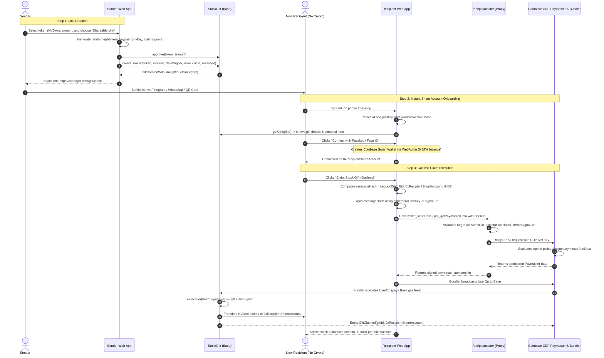

# StonkGift: Ephemeral Keypair Claim Link & Gasless Onboarding Plan 🎁🔗⛽

> **Complete architectural blueprint for address-agnostic gifting and zero-friction user onboarding using Ephemeral Keypairs and Coinbase CDP Paymaster on Base.**

---

## 1. Executive Summary & Problem Statement

### 1.1 The Objective
Allow users to gift tokenized stocks (e.g., NVDAc, AAPLc, TSLA, SPY) to anyone in the world without knowing their wallet address in advance. Senders can share gifts via Telegram, WhatsApp, Discord, X (Twitter), iMessage, email, or printed QR codes inside physical greeting cards.

### 1.2 The Two Primary Friction Barriers in Web3 Gifting
1. **The Security Problem (MEV Front-Running & Brute-Force):**
   * If gifts without designated recipients are stored with an empty recipient (`address(0)`), scanning bots will claim them immediately.
   * If a gift is protected by a simple passphrase or hash pre-image sent during claim (`claim(id, secret)`), public mempool arbitrage bots intercept the transaction, extract the secret, and frontrun with higher priority fees.
2. **The Onboarding Problem (The "Zero-ETH Cold-Start" Dilemma):**
   * A recipient who receives a gift link (e.g., a friend or family member on WhatsApp) often **does not have an active crypto wallet** or **has zero ETH on Base** to pay transaction fees.
   * Forcing a new user to download a browser extension or mobile app, record a 12-word seed phrase, undergo KYC on a centralized exchange, buy ETH, and bridge it to Base results in a **>95% onboarding drop-off rate**.

### 1.3 The Complete Solution: Ephemeral Keypair + Coinbase CDP Paymaster
We combine two breakthrough technologies on **Base**:
* **Client-Side Ephemeral Keypair (Linkdrop / Peanut Protocol Pattern):**
  - Sender generates a one-time cryptographic keypair (`claimSigner` / `privKey`) in their browser.
  - The private key is placed exclusively in the **URL hash fragment** (`#id=1&key=0x...`), remaining 100% client-side and never hitting web servers or logs.
  - The recipient's browser uses `privKey` to sign an authorization binding the claim strictly to the **recipient's smart account address (`msg.sender`)**. MEV bots cannot frontrun because the signature is mathematically invalid for any other address.
* **Coinbase CDP Paymaster & Smart Wallet (ERC-4337 / ERC-7677 / EIP-7702):**
  - **Instant 5-Second Passkey Onboarding:** Recipients log in via Coinbase Smart Wallet or CDP Embedded Wallet with Touch ID / Face ID. No seed phrases, no app downloads.
  - **100% Sponsored Gas:** StonkGift sponsors the claim transaction fee via **Coinbase Developer Platform (CDP) Paymaster**. The recipient claims their stock gift with **0 ETH** in their account.
  - **Base Ecosystem Alignment:** Eligible for up to **$15,000 in gas credits** via the Base Gasless Campaign.

---

## 2. End-to-End System Architecture

```
┌─────────────────────────────────────────────────────────────────────────────────────────────────┐
│                                     SENDER FLOW                                                 │
│                                                                                                 │
│  [Sender Browser]                                                                               │
│         │                                                                                       │
│         ├── 1. Generates disposable keypair: privKey (256-bit) & claimSigner (address)          │
│         ├── 2. Calls StonkGift: createLinkGift(token, amount, claimSigner, unlockTime, msg)      │
│         └── 3. Generates URL: https://stonkgift.com/gift/claim#id=101&key=0x4c08...             │
│                     │                                                                           │
│                     ▼ Shares via WhatsApp / Telegram / Discord / QR Code                        │
└─────────────────────┬───────────────────────────────────────────────────────────────────────────┘
                      │
                      ▼
┌─────────────────────────────────────────────────────────────────────────────────────────────────┐
│                                   RECIPIENT ONBOARDING FLOW                                     │
│                                                                                                 │
│  [Recipient Browser opens Link]                                                                 │
│         │                                                                                       │
│         ├── 1. Reads #id=101 and #key=0x4c08... directly from URL hash fragment                 │
│         ├── 2. Instant Onboarding: Connects via Coinbase Smart Wallet (Face ID / Passkey)        │
│         │      -> Generates Smart Account Address: 0xRecipientSmartAccount (Zero ETH required)  │
│         ├── 3. Signs Claim Hash: keccak256(giftId, 0xRecipientSmartAccount, chainId=8453)       │
│         │      with ephemeral privKey                                                           │
│         │                                                                                       │
│         ├── 4. Submits UserOperation with ERC-7677 Paymaster capability                         │
│         │      Target: /api/paymaster (StonkGift Next.js Paymaster Proxy)                        │
│         │                                                                                       │
│         ▼                                                                                       │
│  [/api/paymaster Proxy (Server-side)]                                                           │
│         │                                                                                       │
│         ├── Validates UserOp calls StonkGift.claimGiftWithSignature                             │
│         ├── Checks rate limits and ensures gift #101 is unclaimed                              │
│         └── Forwards to Coinbase CDP Paymaster endpoint with CDP Client API Key                 │
│                     │                                                                           │
│                     ▼                                                                           │
│  [Coinbase CDP Paymaster & Bundler]                                                             │
│         │                                                                                       │
│         ├── Validates contract allowlist & gas policy rules                                     │
│         ├── Signs paymasterAndData and bundles UserOperation                                    │
│         └── Broadcasts to Base Mainnet (Chain ID: 8453)                                         │
│                     │                                                                           │
│                     ▼                                                                           │
│  [StonkGift Smart Contract (Base)]                                                              │
│         │                                                                                       │
│         ├── Verifies: ecrecover(hash, signature) == gift.claimSigner                           │
│         ├── Confirms timelock and marks gift.claimed = true                                     │
│         └── Transfers tokenized stock (NVDAc) directly to 0xRecipientSmartAccount!              │
│                                                                                                 │
│  🎉 0-ETH Newbie now owns tokenized stock on Base in < 30 seconds!                              │
└─────────────────────────────────────────────────────────────────────────────────────────────────┘
```

---

## 3. Coinbase CDP Paymaster Deep Dive

### 3.1 What is Coinbase CDP Paymaster?
The **Coinbase Developer Platform (CDP) Paymaster** is a fully-managed ERC-4337 / ERC-7677 gas sponsorship service on **Base Mainnet** and **Base Sepolia**. It provides:
1. **Unified Paymaster + Bundler Endpoint:** A single RPC endpoint handles user operation gas estimation, paymaster signing (`pm_getPaymasterStubData`, `pm_getPaymasterData`), and bundling (`eth_sendUserOperation`).
2. **Policy Controls in CDP Portal:** Restrict sponsorship exclusively to allowlisted contracts (`StonkGift`), designated functions, per-user limits, and global USD budget caps.
3. **ERC-7677 Compliance:** Interoperable with Wagmi (`capabilities.paymasterService`), Viem, Permissionless.js, and Coinbase Smart Wallet.
4. **Base Gasless Campaign Grant:** StonkGift can apply for up to **$15,000 in sponsored gas credits** from Coinbase/Base.

### 3.2 Paymaster Endpoint Security & Why a Backend Proxy is Required
As highlighted in Coinbase CDP documentation:
> **Warning:** Your Paymaster endpoint URL contains your Client API Key (`https://api.developer.coinbase.com/rpc/v1/base/...`). If exposed in frontend client-side code, external actors can inspect network traffic, extract the endpoint, and drain your gas sponsorship credits on arbitrary transactions.

**StonkGift Architecture Pattern: Secure Paymaster Proxy (`/api/paymaster`)**
* The raw CDP Paymaster URL is stored in server-side environment variable `CDP_PAYMASTER_URL` (never prefixed with `NEXT_PUBLIC_`).
* The frontend directs all paymaster requests to Next.js API route `/api/paymaster`.
* The proxy performs **validation gates** before relaying requests to Coinbase:
  1. **Contract Destination Check:** Ensures the UserOp destination strictly matches the deployed `StonkGift` contract address.
  2. **Function Selector Check:** Ensures the execution call data starts with `bytes4(keccak256("claimGiftWithSignature(uint256,bytes)"))`.
  3. **Rate Limiting:** Protects against sybil/DDoS bots via IP / session sliding window rate limits (e.g. Upstash Redis).
  4. **State Pre-flight:** Queries Base node to verify `giftId` exists, is not expired, and `claimed == false`.

---

## 4. Sequence Diagram: Frictionless Gasless Onboarding



---

## 5. Technical Implementation Details

### 5.1 Smart Contract Compatibility (`contracts/StonkGift.sol`)

#### Data Structure
```solidity
// SPDX-License-Identifier: MIT
pragma solidity ^0.8.24;

import "@openzeppelin/contracts/token/ERC20/IERC20.sol";
import "@openzeppelin/contracts/token/ERC20/utils/SafeERC20.sol";
import "@openzeppelin/contracts/utils/ReentrancyGuard.sol";
import "@openzeppelin/contracts/utils/cryptography/ECDSA.sol";
import "@openzeppelin/contracts/utils/cryptography/MessageHashUtils.sol";

struct Gift {
    address sender;
    address recipient;     // Direct recipient address (or address(0) if link-based)
    address claimSigner;   // Disposable public address authorized to sign claim
    address token;
    uint256 amount;
    uint256 unlockTime;    // Timestamp (or 0 for instant)
    bool claimed;
    bool cancelled;
    string message;
}
```

#### Smart Account (`msg.sender`) Compatibility
When an ERC-4337 smart account executes a sponsored transaction via a Paymaster and Bundler:
- The entrypoint contract calls the user's smart account (`execute(to, value, data)`).
- The smart account calls `StonkGift.claimGiftWithSignature(giftId, signature)`.
- Inside `StonkGift`, **`msg.sender` is the recipient's smart account address**.
- The ephemeral signature binds `keccak256(abi.encodePacked(giftId, msg.sender, block.chainid))` to `gift.claimSigner`.
- The tokens are transferred via `SafeERC20.safeTransfer(msg.sender, gift.amount)` directly to the smart account.
- **Verdict:** 100% native compatibility with both Smart Accounts (Coinbase Smart Wallet, Safe, Biconomy) and standard EOAs.

```solidity
/**
 * @notice Claims a link-based gift with gasless compatibility.
 * @dev Frontrun-immune: signature binds explicitly to msg.sender (the Smart Account).
 * @param giftId The ID of the gift.
 * @param signature ECDSA signature over keccak256(giftId, msg.sender, chainId).
 */
function claimGiftWithSignature(
    uint256 giftId,
    bytes calldata signature
) external nonReentrant {
    Gift storage gift = gifts[giftId];
    if (gift.sender == address(0)) revert GiftDoesNotExist();
    if (gift.claimSigner == address(0)) revert NotLinkGift();
    if (gift.claimed) revert AlreadyClaimed();
    if (gift.cancelled) revert AlreadyCancelled();

    if (gift.unlockTime != NO_LOCK) {
        if (block.timestamp < gift.unlockTime) revert LockPeriodNotOver();
        if (block.timestamp >= gift.unlockTime + RECLAIM_GRACE_PERIOD) revert ClaimPeriodOver();
    }

    // Bind signature to giftId, msg.sender (recipient smart account), and chainid
    bytes32 messageHash = keccak256(abi.encodePacked(giftId, msg.sender, block.chainid));
    bytes32 ethSignedMessageHash = MessageHashUtils.toEthSignedMessageHash(messageHash);
    address recoveredSigner = ECDSA.recover(ethSignedMessageHash, signature);

    if (recoveredSigner != gift.claimSigner) revert InvalidClaimSignature();

    gift.claimed = true;
    gift.recipient = msg.sender;

    IERC20(gift.token).safeTransfer(msg.sender, gift.amount);

    emit GiftClaimed(giftId, msg.sender);
}
```

---

### 5.2 Secure Paymaster Proxy Route (`app/api/paymaster/route.ts`)

```typescript
import { NextRequest, NextResponse } from "next/server";

// Server-side only env var - NEVER expose with NEXT_PUBLIC_
const CDP_PAYMASTER_URL = process.env.CDP_PAYMASTER_URL;
const STONK_GIFT_ADDRESS = (process.env.NEXT_PUBLIC_STONK_GIFT_ADDRESS || "").toLowerCase();

export async function POST(request: NextRequest) {
  try {
    if (!CDP_PAYMASTER_URL) {
      return NextResponse.json(
        { jsonrpc: "2.0", id: null, error: { code: -32603, message: "Paymaster not configured" } },
        { status: 500 }
      );
    }

    const body = await request.json();
    const { method, params } = body;

    // Optional validation: Ensure sponsored requests target StonkGift contract
    if (method === "pm_getPaymasterStubData" || method === "pm_getPaymasterData") {
      const userOp = params?.[0];
      // Verify call target is STONK_GIFT_ADDRESS
    }

    // Forward JSON-RPC request to Coinbase CDP Paymaster
    const response = await fetch(CDP_PAYMASTER_URL, {
      method: "POST",
      headers: { "Content-Type": "application/json" },
      body: JSON.stringify(body),
    });

    const data = await response.json();
    return NextResponse.json(data, { status: response.status });
  } catch (error) {
    console.error("Paymaster proxy relay error:", error);
    return NextResponse.json(
      { jsonrpc: "2.0", id: null, error: { code: -32603, message: "Internal proxy error" } },
      { status: 500 }
    );
  }
}
```

---

### 5.3 Recipient UI & Gasless Claim Hook (`app/gift/claim/page.tsx`)

Using Wagmi / Viem EIP-5792 capabilities:

```typescript
"use client";

import React, { useState, useEffect } from "react";
import { useAccount } from "wagmi";
import { useWriteContracts, useCapabilities } from "wagmi/experimental";
import { privateKeyToAccount } from "viem/accounts";
import { encodePacked, keccak256 } from "viem";
import { base } from "wagmi/chains";
import { STONK_GIFT_ABI, STONK_GIFT_ADDRESS } from "@/lib/contracts";

export default function ClaimGiftPage() {
  const { address, isConnected } = useAccount();
  const [giftId, setGiftId] = useState<string | null>(null);
  const [privateKey, setPrivateKey] = useState<string | null>(null);

  // Check account capabilities for ERC-7677 / EIP-5792 paymaster support
  const { data: capabilities } = useCapabilities({ account: address });
  const { writeContracts, isPending, isSuccess } = useWriteContracts();

  useEffect(() => {
    if (typeof window === "undefined") return;
    const hash = window.location.hash.substring(1);
    const params = new URLSearchParams(hash);
    setGiftId(params.get("id"));
    setPrivateKey(params.get("key"));
  }, []);

  const handleGaslessClaim = async () => {
    if (!address || !privateKey || !giftId) return;

    // 1. Sign claim hash with ephemeral private key
    const ephemeralAccount = privateKeyToAccount(privateKey as `0x${string}`);
    const messageHash = keccak256(
      encodePacked(
        ["uint256", "address", "uint256"],
        [BigInt(giftId), address, BigInt(base.id)]
      )
    );
    const signature = await ephemeralAccount.signMessage({
      message: { raw: messageHash },
    });

    // 2. Configure Paymaster Proxy capability
    const paymasterSupported = capabilities?.[base.id]?.paymasterService?.supported;
    const paymasterCapabilities = paymasterSupported
      ? {
          paymasterService: {
            url: `${window.location.origin}/api/paymaster`,
          },
        }
      : undefined;

    // 3. Execute sponsored write via Coinbase Smart Wallet
    writeContracts({
      contracts: [
        {
          address: STONK_GIFT_ADDRESS,
          abi: STONK_GIFT_ABI,
          functionName: "claimGiftWithSignature",
          args: [BigInt(giftId), signature],
        },
      ],
      capabilities: paymasterCapabilities,
    });
  };

  return (
    <div className="max-w-md mx-auto p-6 bg-zinc-900 border border-zinc-800 rounded-2xl text-white">
      <h2 className="text-xl font-bold mb-4">Claim Your Tokenized Stock Gift 🎁</h2>
      
      {!isConnected ? (
        <button className="w-full py-3 bg-blue-600 rounded-xl font-medium">
          Connect with Passkey / Face ID
        </button>
      ) : (
        <button
          onClick={handleGaslessClaim}
          disabled={isPending}
          className="w-full py-3 bg-emerald-600 hover:bg-emerald-500 rounded-xl font-bold flex items-center justify-center gap-2"
        >
          {isPending ? "Claiming Gaslessly..." : "Claim Gift (100% Free Gas ⛽)"}
        </button>
      )}

      {isSuccess && (
        <p className="mt-4 text-emerald-400 text-center font-medium">
          🎉 Gift successfully claimed and deposited into your smart wallet!
        </p>
      )}
    </div>
  );
}
```

---

## 6. Security Analysis & Abuse Mitigation

| Threat Vector | Risk Scenario | Mitigation in Architecture |
| :--- | :--- | :--- |
| **Mempool Frontrunning (MEV)** | Arbitrage bots monitoring the mempool steal unallocated gifts. | **Ephemeral Signature Binding:** Signature explicitly includes `msg.sender` (the recipient's smart account). Any frontrunning tx submitted by an attacker reverts in `ecrecover`. |
| **Paymaster Gas Draining** | Attackers flood the Paymaster endpoint with arbitrary transactions to burn developer gas credits. | **Three-Tier Defense:**<br/>1. **CDP Portal Policy:** Contract allowlist restricted strictly to `StonkGift`.<br/>2. **Paymaster Proxy:** Verifies calldata matches `claimGiftWithSignature`.<br/>3. **Rate Limiting:** IP and wallet frequency caps. |
| **Sybil Claim Flooding** | Attacker repeatedly sends requests for nonexistent gift IDs to waste paymaster gas. | **Pre-flight State Check:** `/api/paymaster` verifies `giftId` exists in contract and `claimed == false` prior to sponsoring. |
| **Replay Attacks** | Signature on Base Sepolia replayed on Base Mainnet. | **Domain Separation:** Signature hash binds `block.chainid` (`8453` vs `84532`). |
| **Key Leakage via Server Logs** | URL links sent over web servers leak private keys in access logs. | **RFC 3986 URL Hash:** Secret key lives strictly in `#key=0x...`, which is never sent in HTTP headers or CDN requests. |
| **Unclaimed or Lost Gifts** | Recipient loses link or never claims gift. | **Reclaim & Cancellation:** Sender can cancel before unlock, or reclaim post 180-day grace period. |

---

## 7. Comprehensive Implementation Roadmap

### Phase 1: Smart Contract Upgrades
- [ ] Add `claimSigner` field to `Gift` struct in `contracts/StonkGift.sol`.
- [ ] Implement `createLinkGift` and `claimGiftWithSignature`.
- [ ] Import OpenZeppelin `ECDSA` and `MessageHashUtils`.
- [ ] Add Hardhat unit tests covering:
  - Valid claim by recipient smart account with valid ephemeral signature.
  - Revert when frontrun by unauthorized address.
  - Revert when signature forged or expired.
  - Sender cancellation & reclaim timeouts.

### Phase 2: Client-Side Ephemeral Key Generation
- [ ] Add "Shareable Link" option to `components/CreateGift.tsx`.
- [ ] Integrate `viem/accounts` client-side `generatePrivateKey()` and `privateKeyToAccount()`.
- [ ] Format share link: `https://stonkgift.com/gift/claim#id={giftId}&key={privKey}`.
- [ ] Add 1-click WhatsApp, Telegram, X sharing, and printable QR code generator.

### Phase 3: Coinbase CDP Paymaster & Proxy Setup
- [ ] Create Coinbase Developer Platform (CDP) account and initialize Paymaster on Base Sepolia and Base Mainnet.
- [ ] Add `StonkGift` contract address to the CDP Paymaster Contract Allowlist.
- [ ] Configure spend policies: per-user transaction limit & monthly global budget limit.
- [ ] Implement secure Next.js API route: `app/api/paymaster/route.ts` with server-side `CDP_PAYMASTER_URL`.
- [ ] Add call target and selector validation to the proxy.
- [ ] Apply for the **Base Gasless Campaign ($15,000 gas grant)**.

### Phase 4: Frictionless Recipient Claim Experience
- [ ] Ensure Coinbase Smart Wallet connector is active in `components/Providers.tsx`.
- [ ] Implement `/gift/claim` page with URL `#` hash parser.
- [ ] Enable 1-click Passkey / Face ID login for non-crypto users.
- [ ] Integrate Wagmi `useWriteContracts` / `useCapabilities` targeting `/api/paymaster`.
- [ ] Provide clear visual badge: *"Sponsored by StonkGift (Zero Gas Fee ⛽)"*.
- [ ] Add confetti celebration and portfolio redirect on claim completion.
