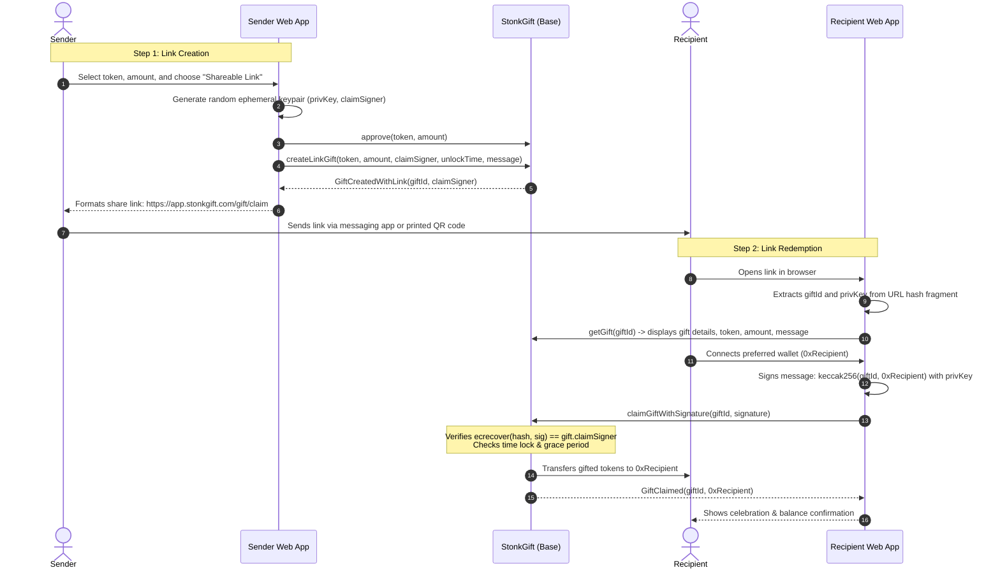

# StonkGift: Ephemeral Keypair Claim Link Implementation Plan 🎁🔗

> **Architecture and implementation design for address-agnostic gifting via secure, MEV-proof claim links on Base.**

---

## 1. Executive Summary & Problem Statement

### 1.1 The Objective
Allow users to gift tokenized stocks (e.g., NVDAc, AAPLc) to anyone without knowing their wallet address in advance. Senders can share gifts via Telegram, WhatsApp, Discord, X (Twitter), email, or printed QR codes inside greeting cards.

### 1.2 The Security Challenge
* **Brute-Force Vulnerability:** If gifts without designated recipients are stored with an empty recipient (`address(0)`), anyone scanning public IDs (`1, 2, 3...`) can claim them immediately.
* **Mempool Front-Running (MEV Bots):** If a gift is protected by a simple passphrase or hash pre-image sent in plain text during claim (`claim(id, secret)`), public mempool arbitrage bots will intercept the transaction, extract the secret, and frontrun with higher priority fees to steal the funds.

### 1.3 The Solution: Ephemeral Keypair (Linkdrop / Peanut Protocol Pattern)
Instead of a secret password, the sender's browser generates a **one-time, disposable cryptographic keypair** locally.
- The **Public Address** (`claimSigner`) is stored in the smart contract.
- The **Private Key** is placed inside the URL **hash fragment** (`#key=0x...`), ensuring it is never transmitted over HTTP or logged by any web server.
- The recipient's browser uses the private key to sign an authorization payload binding the gift strictly to the **recipient's connected address (`msg.sender`)**.
- **Result:** MEV bots cannot frontrun because the signature is mathematically invalid for any address other than the recipient's wallet.

---

## 2. Cryptographic Architecture

```
                                  [Sender's Browser]
                                          │
                  Generates disposable keypair (secp256k1)
                  • privateKey  = 0x4c0883a69... (256-bit entropy)
                  • claimSigner = 0xPublicAddress...
                                          │
         ┌────────────────────────────────┴────────────────────────────────┐
         │                                                                 │
         ▼                                                                 ▼
[Calls StonkGift Contract]                                      [Generates Shareable Link]
createLinkGift(..., claimSigner)                                https://stonkgift.com/gift/claim#id=1&key=0x4c08...
Tokens locked in contract                                       Shared via Telegram / WhatsApp / QR Code
                                                                           │
                                                                           ▼
                                                                [Recipient Opens Link]
                                                                           │
                                                              Reads #key from URL fragment
                                                              Connects Wallet: 0xRecipient...
                                                                           │
                                                              Signs Hash: (giftId + 0xRecipient)
                                                                           │
                                                                           ▼
                                                             [Calls StonkGift Contract]
                                                             claimWithSignature(1, signature)
                                                                           │
                                                             Contract checks:
                                                             ecrecover(hash, sig) == gift.claimSigner
                                                                           │
                                                                           ▼
                                                             Tokens Transferred to 0xRecipient!
```

### Why URL Hash Fragments (`#`)?
In HTTP standards (RFC 3986), everything following the `#` symbol in a URL is strictly client-side:
- It is **never sent in HTTP request headers**.
- It is **never stored in server access logs, CDNs, or analytics platforms**.
- It remains 100% inside the user's browser memory until executed.

---

## 3. Detailed Data Flow & Sequence Diagram



---

## 4. Smart Contract Specification

### 4.1 Data Structure Updates (`contracts/StonkGift.sol`)

The `Gift` struct will be updated to accommodate either a direct recipient wallet or an authorized claim signer:

```solidity
struct Gift {
    address sender;
    address recipient;     // Direct recipient address (or address(0) if link-based)
    address claimSigner;   // Ephemeral public address authorized to sign claim (if link-based)
    address token;
    uint256 amount;
    uint256 unlockTime;    // Timestamp (or 0 for instant)
    bool claimed;
    bool cancelled;
    string message;
}
```

### 4.2 New Errors & Events

```solidity
// Errors
error InvalidClaimSigner();
error InvalidClaimSignature();
error NotLinkGift();

// Events
event GiftCreatedWithLink(
    uint256 indexed giftId,
    address indexed sender,
    address indexed claimSigner,
    address token,
    uint256 amount,
    uint256 unlockTime,
    string message
);
```

### 4.3 Functions to Add

#### `createLinkGift`
```solidity
/**
 * @notice Creates a gift that can be claimed via a link with an authorized signature.
 * @param token Tokenized stock ERC-20 contract address.
 * @param amount Number of tokens to gift.
 * @param claimSigner Public address of the disposable keypair generated by the sender.
 * @param unlockTime Timestamp when gift unlocks, or 0 for instant.
 * @param message Onchain gift message (max 500 characters).
 */
function createLinkGift(
    address token,
    uint256 amount,
    address claimSigner,
    uint256 unlockTime,
    string calldata message
) external nonReentrant returns (uint256 giftId) {
    if (!supportedTokens[token]) revert UnsupportedToken(token);
    if (claimSigner == address(0)) revert InvalidClaimSigner();
    if (amount == 0) revert InvalidAmount();
    if (unlockTime != NO_LOCK && unlockTime <= block.timestamp) revert InvalidUnlockTime();
    if (bytes(message).length > MAX_MESSAGE_LENGTH) revert MessageTooLong();

    uint256 balBefore = IERC20(token).balanceOf(address(this));
    IERC20(token).safeTransferFrom(msg.sender, address(this), amount);
    uint256 received = IERC20(token).balanceOf(address(this)) - balBefore;
    if (received != amount) revert AmountMismatch(amount, received);

    giftId = nextGiftId++;

    gifts[giftId] = Gift({
        sender: msg.sender,
        recipient: address(0), // Link-based gift
        claimSigner: claimSigner,
        token: token,
        amount: amount,
        unlockTime: unlockTime,
        claimed: false,
        cancelled: false,
        message: message
    });

    emit GiftCreatedWithLink(
        giftId,
        msg.sender,
        claimSigner,
        token,
        amount,
        unlockTime,
        message
    );
}
```

#### `claimGiftWithSignature`
```solidity
/**
 * @notice Claims a link-based gift by providing a signature from the authorized claimSigner.
 * @dev Protects against MEV frontrunning by binding the signature to msg.sender.
 * @param giftId ID of the gift.
 * @param signature Cryptographic signature over keccak256(giftId, msg.sender).
 */
function claimGiftWithSignature(
    uint256 giftId,
    bytes calldata signature
) external nonReentrant {
    Gift storage gift = gifts[giftId];
    if (gift.sender == address(0)) revert GiftDoesNotExist();
    if (gift.claimSigner == address(0)) revert NotLinkGift();
    if (gift.claimed) revert AlreadyClaimed();
    if (gift.cancelled) revert AlreadyCancelled();

    if (gift.unlockTime != NO_LOCK) {
        if (block.timestamp < gift.unlockTime) revert LockPeriodNotOver();
        if (block.timestamp >= gift.unlockTime + RECLAIM_GRACE_PERIOD) revert ClaimPeriodOver();
    }

    // Verify ECDSA signature
    bytes32 messageHash = keccak256(abi.encodePacked(giftId, msg.sender, block.chainid));
    bytes32 ethSignedMessageHash = MessageHashUtils.toEthSignedMessageHash(messageHash);
    address recoveredSigner = ECDSA.recover(ethSignedMessageHash, signature);

    if (recoveredSigner != gift.claimSigner) revert InvalidClaimSignature();

    gift.claimed = true;
    gift.recipient = msg.sender; // Record actual claimer

    IERC20(gift.token).safeTransfer(msg.sender, gift.amount);

    emit GiftClaimed(giftId, msg.sender);
}
```

---

## 5. Frontend & UI/UX Specification

### 5.1 Sender Interface: `components/CreateGift.tsx`

1. **Delivery Mode Switch:**
   - 🎯 **Send to Wallet Address**: Standard direct delivery.
   - 🔗 **Shareable Link**: Address-agnostic; generates an instant link & QR code.

2. **Keypair Generation Logic (Client-Side Only):**
   ```typescript
   import { generatePrivateKey, privateKeyToAccount } from 'viem/accounts';

   const ephemeralKey = generatePrivateKey(); // 0x...
   const ephemeralAccount = privateKeyToAccount(ephemeralKey);
   const claimSigner = ephemeralAccount.address; // 0x...
   ```

3. **Share Link Construction:**
   ```typescript
   const claimLink = `${window.location.origin}/gift/claim#id=${giftId}&key=${ephemeralKey}`;
   ```

4. **Gift Creation Modal:**
   - Displays the formatted URL with a 1-click **"Copy Link"** button.
   - Quick action buttons: **Share to Telegram**, **Share to WhatsApp**, **Share to X**.
   - **Download QR Code** for physical cards.

---

### 5.2 Recipient Interface: `app/gift/claim/page.tsx`

1. **URL Hash Parsing:**
   ```typescript
   useEffect(() => {
     if (typeof window === 'undefined') return;
     const hash = window.location.hash.substring(1);
     const params = new URLSearchParams(hash);
     const id = params.get('id');
     const key = params.get('key');
     setGiftId(id);
     setPrivateKey(key);
   }, []);
   ```

2. **Visual Presentation:**
   - Shows gifted stock logo, ticker, amount, and the sender's personalized note.
   - If locked: shows countdown timer until unlock.
   - If unlocked: displays **"Claim Gift"** button.

3. **Signing & Execution Flow:**
   ```typescript
   import { privateKeyToAccount } from 'viem/accounts';

   const handleClaimWithSignature = async () => {
     if (!address || !privateKey || !giftId) return;

     const ephemeralAccount = privateKeyToAccount(privateKey as `0x${string}`);

     // Binds giftId, recipient address, and Base chain ID (8453)
     const messageHash = keccak256(
       encodePacked(
         ['uint256', 'address', 'uint256'],
         [BigInt(giftId), address, BigInt(8453)]
       )
     );

     const signature = await ephemeralAccount.signMessage({
       message: { raw: messageHash }
     });

     writeClaimWithSignature({
       address: contractAddress,
       abi: STONK_GIFT_ABI,
       functionName: 'claimGiftWithSignature',
       args: [BigInt(giftId), signature],
     });
   };
   ```

---

## 6. Security Analysis & Threat Model

| Threat Vector | Mitigation in Architecture | Status |
| :--- | :--- | :--- |
| **Public Mempool Sniping / Frontrunning** | The authorization hash explicitly encodes `msg.sender`. If an MEV bot re-submits the transaction with its own wallet address, the signature immediately fails `ecrecover`. | 🛡️ Immune |
| **ID Enumeration / Brute-Forcing** | Claiming requires a 256-bit cryptographic signature. Guessing the private key has an intractable search space ($2^{256}$). | 🛡️ Immune |
| **Replay Attacks Across Chains** | The signature hash incorporates `block.chainid` (Base: 8453). | 🛡️ Immune |
| **Double-Claiming** | Contract sets `gift.claimed = true` before token transfer with OpenZeppelin `nonReentrant`. | 🛡️ Immune |
| **Server Key Leakage** | The private key is stored strictly after the `#` hash fragment, ensuring it never hits web servers or analytics. | 🛡️ Immune |
| **Lost or Abandoned Links** | Senders retain full rights to cancel before unlock, or reclaim after the 180-day grace period. | 🛡️ Immune |

---

## 7. Implementation Roadmap

### Phase 1: Smart Contract Upgrades
- [ ] Add `claimSigner` field to `Gift` struct.
- [ ] Implement `createLinkGift` and `claimGiftWithSignature`.
- [ ] Add OpenZeppelin `ECDSA` and `MessageHashUtils`.
- [ ] Write unit tests verifying:
  - Valid claim with correct signature.
  - Rejection if frontrun by another wallet address.
  - Rejection if signature forged or invalid.
  - Cancellation by sender before unlock.
  - Reclaim by sender post 180 days.

### Phase 2: Frontend Key Generation
- [ ] Add "Shareable Link" toggle in `CreateGift.tsx`.
- [ ] Integrate client-side ephemeral key generation using `viem`.
- [ ] Update creation dialog with copy link, QR code, and social sharing.

### Phase 3: Recipient Claim Page
- [ ] Build `/gift/claim` page with URL hash fragment parser.
- [ ] Implement client-side message signing using the parsed private key.
- [ ] Connect claim button to `claimGiftWithSignature`.
- [ ] Display confetti animation and balance update upon claim confirmation.

### Phase 4: Gasless Claiming (Optional Extension)
- [ ] Explore Base Account Abstraction (EIP-712 paymaster or Biconomy relayer) so recipients with zero ETH can claim their gift without needing gas.
